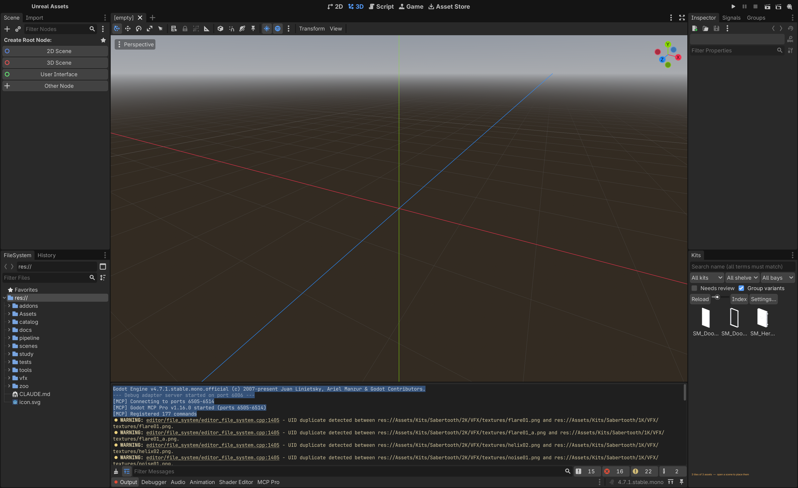

# ProtoForge Kit Browser

A Godot 4.7+ editor dock for browsing 3D asset kits with real, in-editor-rendered
thumbnails, faceted search, and one-click placement into the scene.

Zero dependencies: thumbnails are rendered by the editor itself, on a
`SubViewport`. No Blender, no Python, no external renderer — Godot is the only
thing this addon needs.

## Install

**From the Asset Library:** search for "ProtoForge Kit Browser" in Godot's
AssetLib tab and install it directly into your project.

**Manually:** clone or download this repository into `res://addons/kit_browser`
in your project.

Then enable it under **Project > Project Settings > Plugins**.

## Quick start

1. Enable the plugin. A **Kit Browser** dock appears in the editor.
2. Open **Settings…** (in the dock) and add a folder as an asset root — each
   subfolder of a root is treated as one kit. A root can also be a kit's own
   asset folder: if it holds mesh files directly, with no kit subfolders, the
   root itself becomes a single kit.
3. In **Settings…**, click **Index**. The addon scans every kit under your
   roots, writes an `index.json` per kit, renders any thumbnails that don't
   exist yet, and re-reads the result back into the dock when it's done.
4. Browse, search, and drag assets into the 3D viewport to place them.

## Features

- **Real thumbnails, rendered in-editor** — no external tools, no baked
  renders to keep in sync by hand.
- **Faceted search** — filter by kit, shelf/category, and module bay size, or
  free-text search by name.
- **Variant grouping** — a kit that ships the same prop in two dozen finishes
  shows one tile with a variant count, not two dozen near-duplicates.
- **Adjustable tile size** — a personal editor preference, independent of the
  project.
- **Incremental indexing** — clicking **Index** only scans kits and renders
  thumbnails that are new or changed; a **Force re-index** option in Settings
  rebuilds every index and thumbnail from scratch.
- **Per-kit re-index** — pick a kit and a **Re-index &lt;kit&gt;** button appears
  beside **Settings…**, rebuilding that one kit. Over a library of dozens of
  kits a full force re-index is hours; one kit is minutes. It is also the only
  way to get thumbnails for a kit whose `index.json` another tool wrote (see
  below): that index is kept exactly as it is and only the pictures are
  redrawn.
- **Cancellable** — a long index run can be stopped from its progress popup.
  Kits already finished keep their new indexes, the kit in flight keeps what
  it rendered, and clicking **Index** again carries on from there.
- **Dependency-aware composites** — a composite scene that instances props
  from other kits is shown but not placed while any of those kits is not
  checked out, with the tooltip naming the kits to fetch, instead of loading
  half-built and logging a missing-resource error per prop.

## How indexing works

Each kit gets one `index.json`, written beside its assets, listing every
mesh with its category, size, and module-bay metadata. Thumbnails render to a
`thumbnails/` folder next to that index, one image per mesh.

A file only earns an entry if it has something to draw. Scenes are checked
before rendering and meshes by the render itself, so animation-only glTFs,
tool scenes, and other geometry-less files are left out rather than listed as
tiles that can never have a picture. The one exception is a composite whose
dependency kits are missing: it is indexed but not rendered, and the dock
lists it as unavailable until the kits it needs are checked out.

An `index.json` records which tool wrote it. The addon will not overwrite one
it did not write — a run over a library that mixes hand-managed kits with
addon-indexed ones reports how many it left alone rather than replacing
richer classifications with what a directory scan can infer. **Force
re-index** overrides that for every kit at once. **Re-index &lt;kit&gt;** does
not: it renders the missing thumbnails against the foreign index and leaves
the index itself untouched, which is usually what a kit with blank tiles
actually needs.

A kit that ships composites declares, in `Composites/composites.json`, which
other kits each composite instances props from. The indexer copies that list
into each composite's index entry as `dep_kits`; whether those kits are
present is decided by the browser on the machine reading the index, never
stored in it, since the index is committed with the kit and read on machines
that have fewer kits than the one that wrote it.

Both `index.json` and `thumbnails/` are plain project files — safe to commit
alongside the kit's own assets, so a teammate (or CI) never has to re-render
anything just to browse the library.

## For ProtoForge repos

This addon is source-agnostic by design: kits arrive from Unreal, Unity, or
direct Blender intake, but the browser only ever sees the published
`index.json` contract, plus the `Composites/composites.json` manifest a kit
ships when it has composites.

The development home is `ProtoForgeSystems/unreal-assets`, which carries the
test suites (`tests/test_kit_browser_*.gd`) against its attached kit library.
Edit there, commit and push here, then bump the consuming repos' submodule
pointers.

Mount as a git submodule at `addons/kit_browser` (or `game/addons/kit_browser`
when the Godot project is nested), then enable
`res://addons/kit_browser/plugin.cfg` under `[editor_plugins]` in
`project.godot`.

## License

MIT — see [LICENSE](LICENSE).
